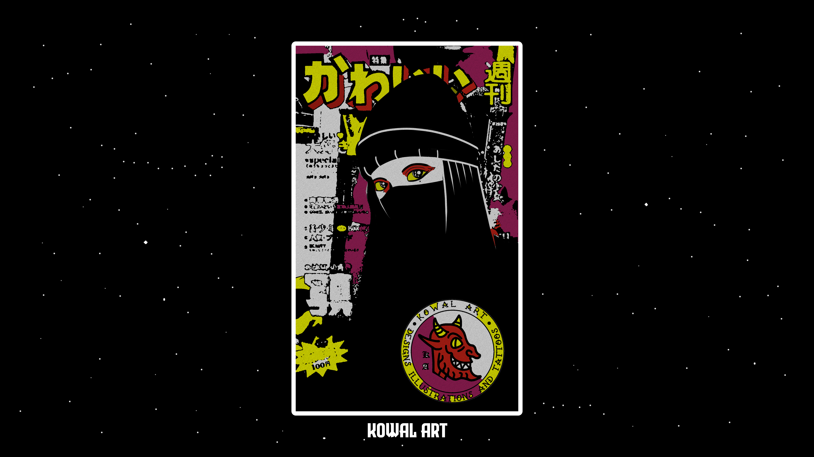

<div align="center">

# ░█▀█░▀▄▀░█░█
# ░█░█░█░█░█▀█
# ░▀▀▀░▀░▀░▀░▀

**[ Arch Linux . Hyprland . Wayland ]**

*dotfiles as a platform — one command, full rice*

---

[](https://archlinux.org)
[](https://hyprland.org)
[](https://www.gnu.org/software/bash/)
[](LICENSE)

</div>

---

## 🖼️ Gallery

<div align="center">

> Screenshots coming soon — run `ricectl install --profile=full` and take your own.



</div>

---

## 📦 Programs

| Component | Program | Link |
|-----------|---------|------|
| **Window Manager** | Hyprland | [hyprland.org](https://hyprland.org) |
| **Terminal** | Alacritty | [github.com/alacritty](https://github.com/alacritty/alacritty) |
| **Alt Terminal** | Kitty | [sw.kovidgoyal.net/kitty](https://sw.kovidgoyal.net/kitty/) |
| **Shell** | Zsh + Powerlevel10k | [github.com/romkatv/powerlevel10k](https://github.com/romkatv/powerlevel10k) |
| **Bar** | Waybar | [github.com/Alexays/Waybar](https://github.com/Alexays/Waybar) |
| **Launcher** | Rofi (Wayland) | [github.com/lbonn/rofi](https://github.com/lbonn/rofi) |
| **Notifications** | Dunst | [github.com/dunst-project/dunst](https://github.com/dunst-project/dunst) |
| **File Manager** | Yazi | [github.com/sxyazi/yazi](https://github.com/sxyazi/yazi) |
| **System Monitor** | Btop | [github.com/aristocratos/btop](https://github.com/aristocratos/btop) |
| **Audio Visualizer** | Cava | [github.com/karlstav/cava](https://github.com/karlstav/cava) |
| **Fetch** | Fastfetch | [github.com/fastfetch-cli/fastfetch](https://github.com/fastfetch-cli/fastfetch) |
| **Login Manager** | SDDM | [github.com/sddm/sddm](https://github.com/sddm/sddm) |
| **Audio** | PipeWire | [pipewire.org](https://pipewire.org) |
| **GTK Theme** | Kvantum + Qt6ct | — |
| **Idle Daemon** | Hypridle | [github.com/hyprwm/hypridle](https://github.com/hyprwm/hypridle) |
| **Lock Screen** | Hyprlock | [github.com/hyprwm/hyprlock](https://github.com/hyprwm/hyprlock) |

---

## ⚡ Installation

**One-liner bootstrap** (clones the repo, installs everything):

```bash
curl -sL https://raw.githubusercontent.com/xhon4/dotfiles/main/install.sh | bash
```

**Manual install:**

```bash
git clone https://github.com/xhon4/dotfiles.git ~/.dotfiles
cd ~/.dotfiles
./ricectl install --profile=full --variant=pc
```

### Profiles

| Profile | What you get |
|---------|-------------|
| `minimal` | Zsh + Alacritty + Fastfetch + Btop |
| `dev` | Minimal + Docker + dev tools |
| `rice` | Hyprland + Waybar + Rofi + Dunst + theming |
| `full` | Everything — all 18 modules |

```bash
# Preview without changes
ricectl install --profile=full --dry-run

# Interactive TUI mode (requires gum)
ricectl install
```

---

## 🛠️ ricectl

The entire setup is managed through `ricectl`, a modular CLI:

```
ricectl install       Provision from a profile (--profile, --variant, --dry-run)
ricectl uninstall     Remove a module (configs + packages + services)
ricectl doctor        Health check across all installed modules
ricectl sync push     Collect configs → commit → push to git
ricectl sync pull     Pull from git → deploy to system
ricectl backup        create / list / restore / clean
ricectl module        list / install / info
ricectl profile       list / show
ricectl secrets       GPG-managed secrets (init / encrypt / decrypt / status)
ricectl update        System + AUR update
```

Features: **idempotent** · **variant-aware** (PC/laptop auto-detection) · **dry-run** · **TUI with [gum](https://github.com/charmbracelet/gum)** · **backup & rollback** · **CI/CD validated**

---

## ⌨️ Keybindings

> `$mod` = <kbd>Super</kbd>

### General

| Keys | Action |
|------|--------|
| <kbd>Super</kbd> + <kbd>Return</kbd> | Open terminal (Alacritty) |
| <kbd>Super</kbd> + <kbd>A</kbd> | App launcher (Rofi) |
| <kbd>Super</kbd> + <kbd>Q</kbd> | Kill active window |
| <kbd>Super</kbd> + <kbd>F</kbd> | Fullscreen |
| <kbd>Super</kbd> + <kbd>V</kbd> | Toggle floating |
| <kbd>Super</kbd> + <kbd>I</kbd> | Toggle split |
| <kbd>Super</kbd> + <kbd>Shift</kbd> + <kbd>M</kbd> | Maximize |
| <kbd>Super</kbd> + <kbd>D</kbd> | Toggle desktop |
| <kbd>Super</kbd> + <kbd>BackSpace</kbd> | Power menu |
| <kbd>Super</kbd> + <kbd>.</kbd> | Emoji picker |
| <kbd>Super</kbd> + <kbd>Shift</kbd> + <kbd>S</kbd> | Screenshot (region) |
| <kbd>Super</kbd> + <kbd>Shift</kbd> + <kbd>R</kbd> | Reload Hyprland |

### Focus & Movement (Vim-style)

| Keys | Action |
|------|--------|
| <kbd>Super</kbd> + <kbd>H</kbd> | Focus left |
| <kbd>Super</kbd> + <kbd>J</kbd> | Focus down |
| <kbd>Super</kbd> + <kbd>K</kbd> | Focus up |
| <kbd>Super</kbd> + <kbd>L</kbd> | Focus right |
| <kbd>Super</kbd> + <kbd>Shift</kbd> + <kbd>H</kbd> | Swap left |
| <kbd>Super</kbd> + <kbd>Shift</kbd> + <kbd>J</kbd> | Swap down |
| <kbd>Super</kbd> + <kbd>Shift</kbd> + <kbd>K</kbd> | Swap up |
| <kbd>Super</kbd> + <kbd>Shift</kbd> + <kbd>L</kbd> | Swap right |

### Workspaces

| Keys | Action |
|------|--------|
| <kbd>Super</kbd> + <kbd>1-9</kbd> | Switch to workspace 1–9 |
| <kbd>Super</kbd> + <kbd>Shift</kbd> + <kbd>1-9</kbd> | Move window to workspace 1–9 |

### Mouse

| Keys | Action |
|------|--------|
| <kbd>Super</kbd> + <kbd>LMB Drag</kbd> | Move window |
| <kbd>Super</kbd> + <kbd>RMB Drag</kbd> | Resize window |

---

## 🏗️ Architecture

```
dotfiles/
├── ricectl                 CLI entrypoint
├── install.sh              Bootstrap (curl | sh)
├── Makefile                Make targets
├── lib/
│   ├── core.sh             Logging · YAML parser · helpers
│   ├── os.sh               OS / GPU / chassis detection
│   ├── packages.sh         Pacman & AUR management
│   ├── deploy.sh           Config deployment engine
│   └── tui.sh              Interactive TUI (gum)
├── modules/                18 self-contained modules
│   └── */module.yaml       Packages · services · configs · hooks
├── profiles/               Declarative profile definitions
│   ├── minimal.yaml
│   ├── dev.yaml
│   ├── rice.yaml
│   └── full.yaml
├── configs/
│   ├── common/             Shared configs
│   └── variants/           Per-machine overrides (pc / laptop)
├── system/                 System-level (SDDM theme)
├── secrets/                GPG-encrypted (gitignored)
└── backups/                Config snapshots (gitignored)
```

---

## 📋 Requirements

- **Arch Linux**
- Normal user with `sudo` access
- Internet connection
- `gum` — optional, for TUI (`sudo pacman -S gum`)

---

<div align="center">

**[OXH](https://github.com/xhon4)** · MIT License

</div>
